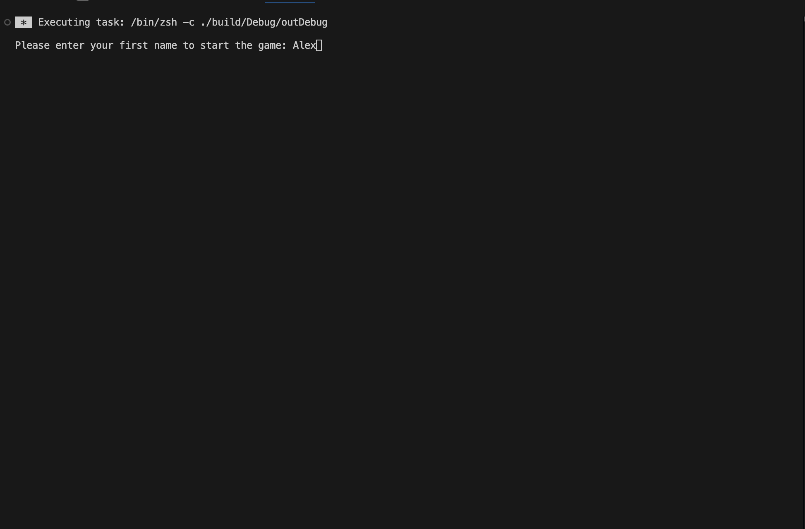
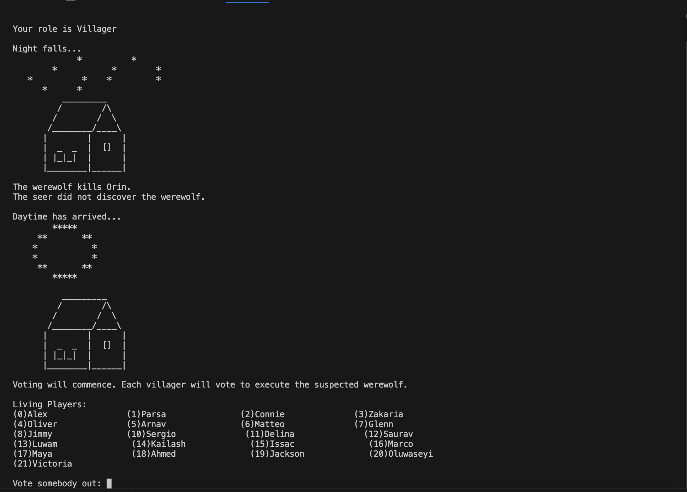
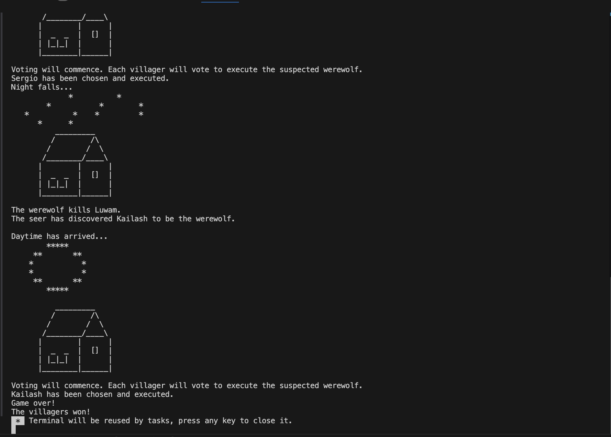

# Werewolf Game

**Author:** 
Alexander Li

**Intro:**
The werewolf game is about survival. In the beginning, one random villager is the werewolf, and another is the seer.
Each night, the werewolf kills a villager, and the seer tries to reveal the werewolf. The following day, the entire
village votes on the suspected werewolf. That person is executed, and the next round begins...

The game ends when the werewolf is killed, or all but one villager is alive.

---

**Links:**

Video Summary: https://www.youtube.com/watch?v=Cq9NgAr6wY4

Project Rubric checklist: https://github.com/AlexDude1015/Projects/blob/main/CS25/Project/project_rubric.md

Source Code: https://github.com/AlexDude1015/Projects/blob/main/CS25/Project/werewolf.cpp

---

**Screenshots**

The player enters their name.

---

The player is randomly selected as a villager, werewolf, or seer. They can target or vote other players which will impact the game.

---

Eventually, the game will end when all but one villager remains or the werewolf was executed.

